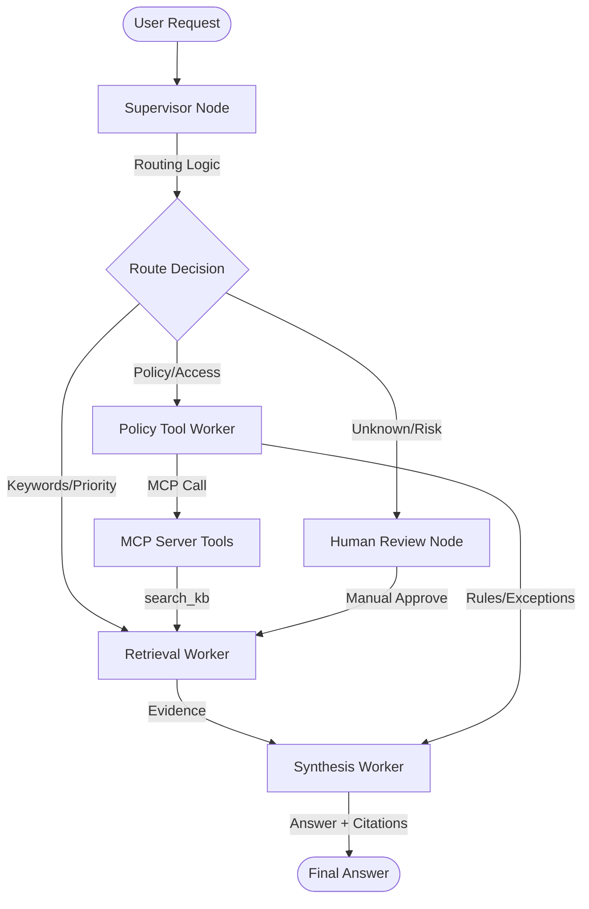

# System Architecture — Lab Day 09

**Nhóm:** 68  
**Ngày:** 14/4/2026
**Version:** 1.0

---

## 1. Tổng quan kiến trúc

Hệ thống RAG đa tác nhân (Multi-Agent RAG) được xây dựng theo mô hình **Supervisor-Worker**. Thay vì một prompt khổng lồ xử lý mọi việc, hệ thống chia nhỏ trách nhiệm thành các worker chuyên biệt (Retrieval, Policy, Synthesis) dưới sự điều phối của một Supervisor trung tâm.

**Pattern đã chọn:** Supervisor-Worker  
**Lý do chọn pattern này (thay vì single agent):**
- **Tính module hóa:** Có thể phát triển và kiểm thử từng worker một cách độc lập.
- **Khả năng mở rộng:** Dễ dàng thêm các năng lực mới (MCP tools) mà không cần thay đổi logic xử lý văn bản chính.
- **Khả năng quan sát (Observability):** Trace ghi lại lý do định tuyến (route_reason), giúp dễ dàng truy vết khi hệ thống trả lời sai.

---

## 2. Sơ đồ Pipeline

---

## 3. Vai trò từng thành phần

### Supervisor (`graph.py`)

| Thuộc tính | Mô tả |
|-----------|-------|
| **Nhiệm vụ** | Phân tích task đầu vào và quyết định worker nào sẽ xử lý. |
| **Input** | Task (câu hỏi) từ người dùng. |
| **Output** | `supervisor_route`, `route_reason`, `risk_high`, `needs_tool`. |
| **Routing logic** | Keyword-based matching với các bộ từ khóa ưu tiên (P1 > Policy > HITL). |
| **HITL condition** | Trigger khi câu hỏi chứa mã lỗi lạ (ERR-) hoặc các từ khóa rủi ro cao. |

### Retrieval Worker (`workers/retrieval.py`)

| Thuộc tính | Mô tả |
|-----------|-------|
| **Nhiệm vụ** | Tìm kiếm đoạn văn bản (chunks) liên quan từ ChromaDB. |
| **Embedding model** | `all-MiniLM-L6-v2`. |
| **Top-k** | 10 (để đảm bảo độ bao phủ cho các truy vấn phức tạp). |
| **Stateless?** | Yes. |

### Policy Tool Worker (`workers/policy_tool.py`)

| Thuộc tính | Mô tả |
|-----------|-------|
| **Nhiệm vụ** | Kiểm tra các ngoại lệ chính sách (Flash Sale, Digital Products) bằng logic rule-based. |
| **MCP tools gọi** | `search_kb`, `get_ticket_info`. |
| **Exception cases xử lý** | Flash Sale, Digital Items, Activated Products, Temporal Scoping (v3 vs v4). |

### Synthesis Worker (`workers/synthesis.py`)

| Thuộc tính | Mô tả |
|-----------|-------|
| **LLM model** | `gpt-4o-mini`. |
| **Temperature** | 0.0 (để giảm thiểu hallucination). |
| **Grounding strategy** | Strict context adherence (chỉ trả lời từ context) kèm dẫn chứng [source]. |
| **Abstain condition** | Trả về "Không đủ thông tin" nếu Confidence < 0.4. |

### MCP Server (`mcp_server.py`)

| Tool | Input | Output |
|------|-------|--------|
| search_kb | query, top_k | chunks, sources |
| get_ticket_info | ticket_id | ticket details (priority, status) |
| check_access_permission | access_level, requester_role | can_grant, approvers |

---

## 4. Shared State Schema

| Field | Type | Mô tả | Ai đọc/ghi |
|-------|------|-------|-----------|
| task | str | Câu hỏi đầu vào | Supervisor đọc |
| supervisor_route | str | Worker được chọn | Supervisor ghi |
| route_reason | str | Lý do định tuyến chi tiết | Supervisor ghi |
| retrieved_chunks | list | Danh sách evidence từ vector database | Retrieval ghi, Synthesis đọc |
| policy_result | dict | Kết quả phân tích ngoại lệ chính sách | Policy ghi, Synthesis đọc |
| mcp_tools_used | list | Log các công cụ MCP đã được sử dụng | Policy ghi |
| final_answer | str | Câu trả lời cuối cùng cho người dùng | Synthesis ghi |
| confidence | float | Độ tin cậy của câu trả lời (0.0 - 1.0) | Synthesis ghi |

---

## 5. Lý do chọn Supervisor-Worker so với Single Agent (Day 08)

| Tiêu chí | Single Agent (Day 08) | Supervisor-Worker (Day 09) |
|----------|----------------------|--------------------------|
| Debug khi sai | Khó — phải mò trong một prompt khổng lồ | Dễ hơn — trace chỉ rõ worker nào fail |
| Thêm capability mới | Phải sửa toàn bộ prompt và flow | Thêm worker hoặc MCP tool mới độc lập |
| Routing visibility | Không có | Rõ ràng qua `route_reason` và `supervisor_route` |
| Khả năng mở rộng | Giới hạn bởi context window và sự nhầm lẫn của LLM | Gần như không giới hạn nhờ chia nhỏ tác vụ |

---

## 6. Giới hạn và điểm cần cải tiến

1. **Routing Logic đơn giản**: Hiện tại dùng keyword-matching, có thể nâng cấp lên LLM-based classifier để linh hoạt hơn.
2. **Sequential Execution**: Các worker hiện đang chạy tuần tự, có thể song song hóa để giảm latency.
3. **HITL tự động**: Cần implement cơ chế interrupt thật sự để chờ con người phản hồi thay vì auto-approve như hiện tại.
